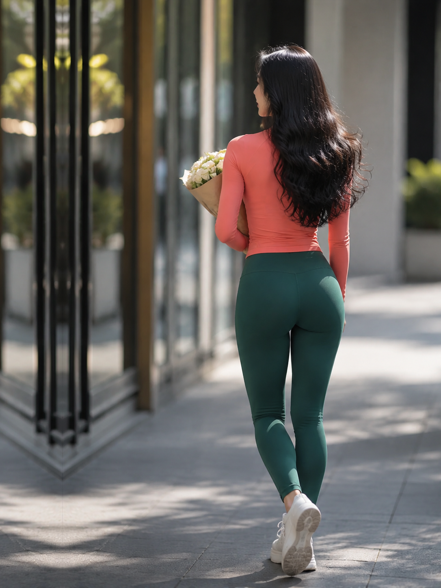
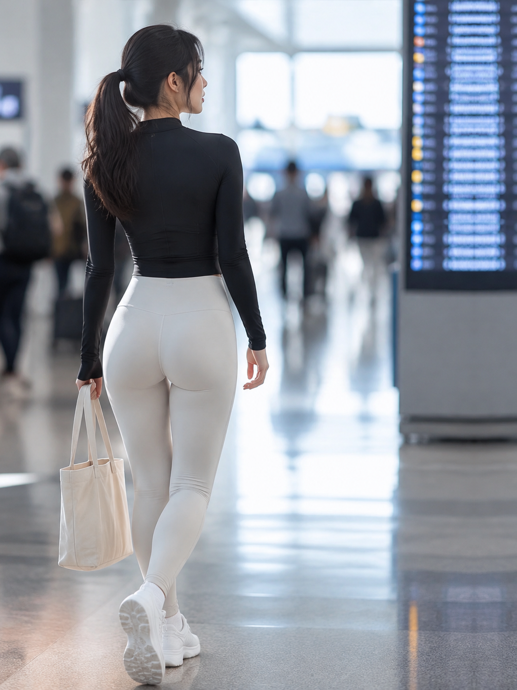

# Yujia V2.3｜微信贴图号瑜伽裤写实女性曲线美感贴图生成 Skill

> 一个面向 ChatGPT / Codex / OpenAI 图像生成工作流的严格摄影型 Skill。  
> 核心目标不是“批量生成美女图”，而是稳定生成 **成年中国女性、真实生活场景、运动服装、自然身体曲线、纪实摄影质感** 的 3:4 竖版贴图，并通过批次规划、逐图验收与程序化检查，尽量避免同脸、同姿势、同场景、同光线和拼图式输出。

---

## 项目定位

Yujia V2.3 是一套针对写实女性运动生活方式图片设计的生成规范与质量控制系统。

它关注的是 **成年女性身体线条的自然美感**：腰部、髋部、腿部与整体体态之间连续、真实、符合人体结构的视觉关系；同时通过瑜伽裤、紧身运动上衣等日常运动服装呈现身体轮廓。

项目刻意避免把这种审美处理成色情化或棚拍式“性感写真”。它更偏向：

- 真实街道、社区、公园、住宅、车站等生活场景；
- 自然走路、停留、整理衣物、拿包等日常动作；
- 长焦摄影、浅景深、自然环境光；
- 完整成年人比例与真实服装材质；
- 身体曲线自然、有体积感，但不过度夸张；
- 不使用透明服装、湿身材质、明显私密轮廓或挑逗动作；
- 不依赖正面凝视镜头来制造“写真感”。

换句话说：**它想生成的是“街头摄影里恰好出现了一个身材线条很好看的成年女性”，而不是“为了镜头摆拍的性感模特”。**

---

## V2.3 主要解决什么问题

普通图像生成模型在连续生成同一视觉主题时，很容易发生以下退化：

1. 多张图片逐渐变成同一张脸；
2. 发型、上衣、动作只是轻微换色；
3. 场景反复回到同一种街道或室内背景；
4. 光线方向、机位、人物姿态高度相似；
5. 人物自动居中，破坏留白构图；
6. 批量请求被模型理解成拼图、九宫格或 contact sheet；
7. 背景自动出现路人、镜面人物或海报人物；
8. 浅色瑜伽裤被生成成透明、过曝或不自然身体结构；
9. 模型只改变裤子颜色，却把它当成“全新人物”；
10. 图像看似漂亮，但整批放在一起明显像同一次 AI 拍摄。

Yujia V2.3 的重点，就是把这些问题从“提示词建议”提升为 **硬规则 + 批次规划 + 验收门禁**。

---

## 核心特性

### 1. 一图一文件，一图一人

V2.3 把这条规则设置为最高优先级：

- 一个输出文件只能有一张完整照片；
- 禁止拼图、网格、双联画、故事板、contact sheet；
- 一张照片中只能出现一个人；
- 背景路人、玻璃反射、海报人物、屏幕人物、车辆中的人、局部肢体同样算第二个人；
- 任何违反该规则的输出必须废弃并重新生成。

### 2. 固定 3:4 竖版摄影系统

默认目标：

- 3:4 纵向构图；
- 推荐约 1080×1440；
- 完整全身；
- 人物视觉中心严格位于左侧或右侧三分之一；
- 中央 42%–58% 区域为人物中心禁区；
- 人物运动或面部朝向优先面向更宽的留白区域。

这种构图特别适合微信、小红书、美篇等图文内容后续添加标题或文案。

### 3. 纪实长焦视觉

默认摄影语言强调：

- 85–135mm 长焦压缩感；
- 推荐 100–135mm 视觉效果；
- 腰部或髋部附近机位；
- 轻微侧后方角度；
- 浅景深；
- 环境仍然可识别；
- 不使用明显广角畸变；
- 不使用夸张低机位“仰拍身体”。

### 4. 成年女性身体曲线的自然表达

人物限定为清晰可判断的成年中国女性，当前 V2.3 标准为 20–30 岁。

身体表现强调：

- 真实 7.5–8 头身比例；
- 肩、腰、髋、腿之间结构连续；
- 腰臀过渡有自然体积；
- 瑜伽裤覆盖区域保持符合人体结构的平滑连续性；
- 允许自然运动型体态，但拒绝极端比例；
- 避免“臀部独立于躯干”“局部膨胀”“人体分段”等常见 AI 失败；
- 不以私密部位轮廓作为视觉重点。

### 5. 固定服装类别，强制设计变化

主要服装体系：

- 合身运动上衣；
- 高腰、全长瑜伽裤；
- 不透明、中等厚度、哑光运动面料；
- 自然褶皱、受力和明暗层次；
- 浅色或明亮色瑜伽裤优先。

允许的上衣廓形包括：

- 长袖圆领运动上衣；
- 长袖半拉链运动上衣；
- 短袖圆领运动上衣；
- cap-sleeve 运动上衣；
- 无袖运动上衣；
- mock-neck 无袖运动上衣；
- 合身短款长袖或短袖运动上衣等。

对于 10 张以内的批次，**同一种上衣廓形不得重复**。

### 6. 批次级身份差异化

每一张图片在规划阶段就必须拥有独立的：

- `subject_id`；
- 面部身份描述；
- 脸型与五官组合；
- 身材类型；
- 发型；
- 上衣廓形；
- 场景；
- 动作 / 道具；
- 色彩组合；
- 光线方案；
- 构图侧别。

对于 N≤10 的批次，多个关键维度禁止重复。

这意味着 V2.3 不接受：

> 同一张脸 + 同一发型 + 同一街道 + 同一阳光，只把裤子从粉色换成蓝色。

这种输出会被判定为批次多样性失败。

### 7. 逐图验收，而不是生成完再看

每生成一张图片立即执行 Gate 1 验收：

- 文件是否为单图；
- 是否只有一个成年人；
- 人物是否位于正确三分之一；
- 是否完整显示头部和脚部；
- 是否无直接看镜头；
- 身份是否与之前人物明显不同；
- 发型 / 上衣 / 场景 / 动作 / 配色 / 光线是否符合计划；
- 人体结构是否合理；
- 服装是否不透明；
- 是否出现水印或无关品牌；
- 当前版本要求的环境中文字是否真实可读。

任何硬条件失败：

```text
FAIL — REGENERATE
```

失败图片不计入最终数量。

### 8. 每两张执行一次跨图审查

每接受两张图片，必须与此前所有已接受图片对比，而不只是比较最新两张。

主要检查：

- 是否开始出现同脸；
- 发型轮廓是否接近；
- 上衣剪裁是否反复；
- 场景是否只是同一模板轻微变化；
- 动作与人物姿态是否高度相似；
- 光线方向是否固定；
- 是否出现“AI 同一次拍摄”的视觉模板。

### 9. 整批最终 Gate

全部生成完成后，还需要进行 Gate 3：

- 核对图片数量；
- 核对批次计划；
- 检查重复身份；
- 检查场景、动作、服装、色彩、光线重复；
- 检查构图左右分布；
- 检查环境文字；
- 检查人体结构与服装材质；
- 生成最终 PASS / FAIL 结论。

只有最终状态为：

```text
PASS — deliver
```

才视为一个完整批次。

---

## Benchmark 视觉参考

V2.3 自带两张 benchmark 图，只用于建立摄影系统，不用于复制人物身份。

### Outdoor benchmark



主要参考：

- 户外方向光；
- 全身尺度；
- 长焦压缩；
- 地面阴影；
- 发丝边缘；
- 背景层次。

### Indoor benchmark



主要参考：

- 窗边自然光；
- 室内纵深；
- 浅色服装曝光控制；
- 地面反射；
- 明亮但不过曝的背景。

> Benchmark 是“摄影语言参考”，不是人物模板。Skill 明确禁止复制 benchmark 的脸、发型、服装剪裁、姿势和场景。

---

## 项目结构

```text
yujia-v2.3/
├─ SKILL.md
│  └─ Skill 主入口：执行模式、硬规则、批次流程、运行时限制
│
├─ agents/
│  └─ openai.yaml
│     └─ OpenAI / Codex Skill 展示名称、简介、默认提示词与产品策略
│
├─ assets/
│  ├─ benchmark-outdoor.png
│  ├─ benchmark-indoor.png
│  └─ icon.svg
│
├─ references/
│  ├─ visual-standard.md
│  │  └─ 摄影、人物、身体比例、服装、场景、光线和共享生成 Prompt
│  │
│  ├─ acceptance-review.md
│  │  └─ Gate 0 / Gate 1 / Gate 2 / Gate 3 强制验收协议
│  │
│  └─ batch-plan-schema.md
│     └─ batch-plan.json 数据结构与批次差异化规则
│
└─ scripts/
   └─ validate_batch.py
      └─ 批量输出尺寸、比例、重复文件、视觉近重复与 manifest 检查器
```

---

## 工作流程

```text
用户请求
   ↓
解析数量 / 场景 / 服装 / 左右构图
   ↓
读取 visual-standard.md
   ↓
建立 batch-plan.json
   ↓
检查运行时是否支持严格单图生成
   ↓
生成 Image 01
   ↓
Gate 1：逐图硬验收
   ├─ FAIL → 定向重生成
   └─ PASS
       ↓
生成 Image 02
       ↓
Gate 1
       ↓
Gate 2：与全部已接受图片交叉审查
       ↓
继续逐张生成
       ↓
validate_batch.py
       ↓
Gate 3：整批审查
       ↓
PASS — deliver
```

---

## Batch Plan

批量生成前必须创建 `batch-plan.json`。

示例：

```json
{
  "skill": "yujia-v2-3",
  "count": 2,
  "alternate_sides": true,
  "one_file_one_photo": true,
  "one_human_per_photo": true,
  "images": [
    {
      "number": 1,
      "file_stub": "01_住宅公园_左侧三分之一",
      "side": "LEFT",
      "subject_id": "S01",
      "identity": "oval face; straight brows; narrow nose bridge; tall/slender athletic frame",
      "hairstyle": "long loose waves",
      "top_style": "fitted short-sleeve crew-neck athletic top",
      "scene": "residential park path",
      "action_prop": "walking with folded light jacket",
      "palette": "warm ivory top + sage leggings + white shoes",
      "lighting": "tree-filtered directional daylight from camera-right",
      "environment_text": "社区服务中心",
      "text_surface": "wall-mounted community office plaque",
      "difference_from_previous": "first image"
    }
  ]
}
```

### N≤10 的强制差异字段

以下字段原则上不得重复：

```text
subject_id
identity
hairstyle
top_style
scene
action_prop
palette
lighting
environment_text
```

身份 `subject_id` 与 `identity` 在任何批次规模下都必须保持人物唯一性。

---

## 环境中文字规则

**当前上传的 V2.3 版本仍然把“可读中文环境文字”定义为硬性规则。**

每张图片至少需要一个自然存在于场景中的短中文，例如：

```text
便利店
早餐店
水果店
鲜果
手机维修
五金店
快递驿站
社区服务中心
物业服务中心
地铁站入口
A出口
停车场
生活超市
```

要求：

- 必须存在于真实物体表面；
- 如门店招牌、门牌、墙面通知、地铁标识、停车牌等；
- 透视和光线必须符合现场；
- 不能变成后期字幕或漂浮标题；
- 乱码、伪中文或无法阅读均判定为失败。

如果后续版本决定取消该规则，应同时修改：

```text
SKILL.md
references/visual-standard.md
references/acceptance-review.md
references/batch-plan-schema.md
scripts/validate_batch.py
agents/openai.yaml
```

否则会出现规范互相冲突。

---

## Runtime Safety Guard

V2.3 对 ChatGPT 对话式图片生成和 Codex / Work 式显式 Prompt 环境进行了区分。

### ChatGPT 对话式生成器

如果图片工具会从整段对话推断当前生成意图，那么用户一句：

```text
生成 10 张
```

有可能被模型解释成：

```text
在一张画布上生成 10 个格子
```

因此严格模式下：

- 当前生成回合只能语义上要求“一张”；
- 一张生成并验收后，再进入下一张；
- 不允许把 collage 裁开冒充独立文件；
- 无法保证隔离 Prompt 时，不应声称“严格批量模式已完成”。

### Codex / Work / 显式单图 Prompt Runtime

如果运行环境能够对每一张图发送独立 Prompt 并单独保存文件，则可以自动执行完整批次：

```text
row 01 → prompt 01 → n=1 → save → review
row 02 → prompt 02 → n=1 → save → review
...
```

每一次单图 Prompt 不应提及“10 张”“系列”“多图”“variants”“grid”等容易诱发拼图的语义。

---

## 程序化验证

`scripts/validate_batch.py` 用于对生成结果进行机器可检查部分的验收。

依赖：

```bash
pip install pillow
```

基本用法：

```bash
python scripts/validate_batch.py ./outputs \
  --expected-count 10 \
  --manifest ./batch-plan.json \
  --strict
```

主要检查：

- 输出数量；
- 图像能否正常读取；
- 是否为纵向图；
- 是否接近严格 3:4；
- 最短边分辨率；
- SHA-256 完全重复；
- dHash 视觉近重复；
- batch-plan 必填字段；
- N≤10 时关键字段重复；
- 左右构图计划是否交替；
- `file_stub` 是否能在结果中找到。

需要注意：程序无法可靠判断所有视觉问题，因此以下内容仍必须人工 / 多模态模型复核：

- 是否真的只有一个人；
- 是否存在背景或反射人物；
- 实际人物视觉中心位置；
- 面部是否近似同一身份；
- 人体结构；
- 服装是否出现私密轮廓；
- 环境中文字是否真正可读；
- 光线、姿态与审美质量。

---

## 文件命名建议

通过验收的图片使用稳定命名：

```text
01_住宅公园_左侧三分之一.png
02_社区街道_右侧三分之一.png
03_地铁入口_左侧三分之一.png
```

文件名中的左右位置必须与实际画面一致。

---

## 推荐调用方式

### 单张生成

```text
使用 Yujia V2.3 生成一张图。
生活化写实摄影，成年中国女性，运动紧身服装，完整全身，
自然表现身体腰髋腿之间的曲线关系，人物放在右侧三分之一，
使用长焦纪实摄影语言，不看镜头，只生成一个人物、一张独立照片。
```

### 批量生成

```text
使用 Yujia V2.3 建立 10 张图片的 batch plan，
要求人物身份、发型、上衣剪裁、场景、动作、配色和光线全部形成明显差异。
按计划逐张独立生成，每张完成后立即执行 Gate 1，
每两张执行跨图审查，全部完成后运行程序化检查和 Gate 3 最终审查。
```

---

## 安装到 Codex Skill 目录

### Windows

克隆仓库：

```powershell
git clone <YOUR_REPOSITORY_URL>
```

复制 Skill：

```powershell
$dest = Join-Path $env:USERPROFILE ".codex\skills\yujia-v2.3"
Copy-Item ".\yujia-v2.3" $dest -Recurse
```

典型目标目录：

```text
C:\Users\<用户名>\.codex\skills\yujia-v2.3\
```

### macOS / Linux

```bash
git clone <YOUR_REPOSITORY_URL>
mkdir -p ~/.codex/skills
cp -R ./yujia-v2.3 ~/.codex/skills/yujia-v2.3
```

> 如果仓库根目录本身就是 Skill 目录，则复制仓库根目录内容即可，不要额外嵌套一层同名目录。

---

## 验收哲学

Yujia V2.3 的核心不是“Prompt 越长越好”，而是：

```text
计划 → 单张生成 → 硬验收 → 跨图比较 → 程序验证 → 整批验收
```

它宁可丢弃一张“看起来还不错”的图片，也不接受：

- 同一身份反复换衣服；
- 一张图片里出现第二个人；
- 人物重新跑回画面中央；
- 通过拼图假装完成批量任务；
- 身体结构明显错误；
- 浅色运动裤因过曝失去材质和体积；
- 单张漂亮但整批高度雷同。

这种设计更接近一个小型摄影制作流程，而不是单次 Prompt。

---

## 安全与内容边界

本项目讨论和表达的是 **成年女性身体曲线、运动服装设计与生活方式摄影审美**。

当前规范明确要求：

- 人物必须清晰为成年人；
- 不生成未成年人或年龄模糊人物；
- 不使用透明服装；
- 不展示私密部位；
- 不突出私密部位轮廓；
- 不使用明显性行为或色情姿势；
- 不以偷拍、羞辱或非自愿语境为目标；
- 不把 benchmark 人物身份复制为新人物。

---

## V2.3 已知版本字符串问题

当前压缩包主体入口为：

```text
name: yujia-v2-3
```

但部分历史文件仍保留 V2.2 字样，包括：

```text
references/visual-standard.md        → 标题仍为 Yujia V2.2
references/batch-plan-schema.md      → 标题与 JSON 示例仍含 yujia-v2-2
references/acceptance-review.md      → Acceptance Report 模板仍写 V2.2
agents/openai.yaml                   → default_prompt 仍调用 $yujia-v2-2
```

发布 GitHub Release 前建议统一替换为 `yujia-v2-3` / `Yujia V2.3`，避免运行时错误调用旧 Skill。

---

## Roadmap

未来可以继续迭代：

- [ ] V2.3 内部版本号彻底统一；
- [ ] 可配置是否要求环境中文字；
- [ ] 增加人物视觉中心自动检测；
- [ ] 增加多模态人体结构自动评分；
- [ ] 增加人脸 embedding 相似度检测，降低批次同脸率；
- [ ] 将发型 / 上衣 / 场景 / 光线词表独立为可扩展配置；
- [ ] 自动生成 batch-plan.json；
- [ ] 自动生成 `acceptance-report.md`；
- [ ] 增加批次 contact sheet，仅用于最终人工审查；
- [ ] 建立更多室内、街道、社区、交通场景 benchmark。

---

## Version

**Yujia V2.3**

关键词：

```text
photorealistic
lifestyle photography
adult women
Chinese women
yoga leggings
body silhouette
rule of thirds
telephoto photography
batch diversity
image generation skill
acceptance audit
Codex Skill
OpenAI image generation
```

---

## License

本仓库暂未附带开源许可证。

如果准备公开发布，请在正式开放源码前补充合适的 `LICENSE` 文件，并根据你希望他人“可否商用 / 可否修改 / 是否必须署名 / 是否允许二次分发”的范围选择许可证。

